# [Credit Fraud Detection](https://www.kaggle.com/datasets/mlg-ulb/creditcardfraud)

## Summary

The dataset contains transaction made by credit cards in September 2013 by european cardholders. This dataset presents transactions information that occurred over a period of two days, with 492 cases of fraud out of 284,807 transactions. The dataset is heavily skewed towards non-fraudulent transactions, with the positive class (frauds) accounting for 0.172% of all transactions.

The input variables in the dataset are all numerical and have been obtained through a PCA transformation. However, due to confidentiality converns, the original features and additional contextual information are not provided.

The features V1 through V28 represent the principal components derived from the PCA transformation, while the features Time and Amount have not been transformed. The Time feature denotes the number of seconds elapsed between each transaction and the first transaction in the dataset, while the Amount feature represents the monetary value of each transaction. The response variable, Class, take a value of 1 in case of fraud and 0 otherwise. The amount feature can be used for cost-sensitive learning, depending on the specific machine learning algorithm chosen.

## Data Exploratory

### Transaction in Time

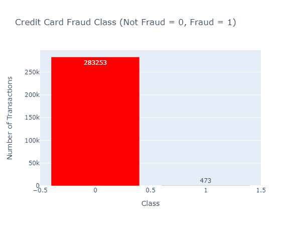

From the above graph, Out of all transactions, only 492 (0.172%) are fraudulent. This indicates that the data is severely imbalanced in regards to the target variable `Class`.

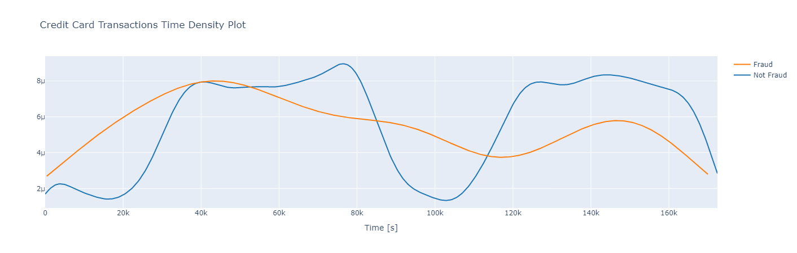

raudulent transactions are evenly distributed in time, including during low real transaction times, such as at night in the European timezone. This distribution is more uniform than that of valid transactions.

To further analyze this, we will examine the time distribution of both types of transactions, as well as the total transaction count and amount per hour. It is assumed that the time unit is second, based on observations of the transaction time distribution:

* Class 0: Valid transaction (Blue)
* Class 1: Fraudulent transaction (Red)

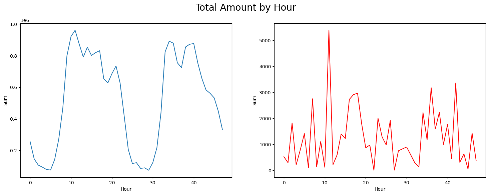

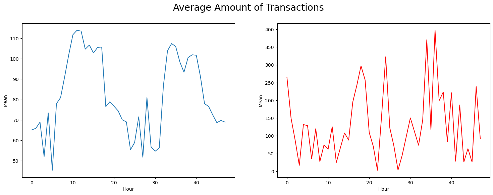

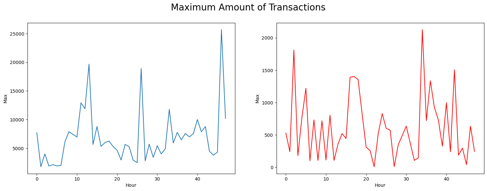

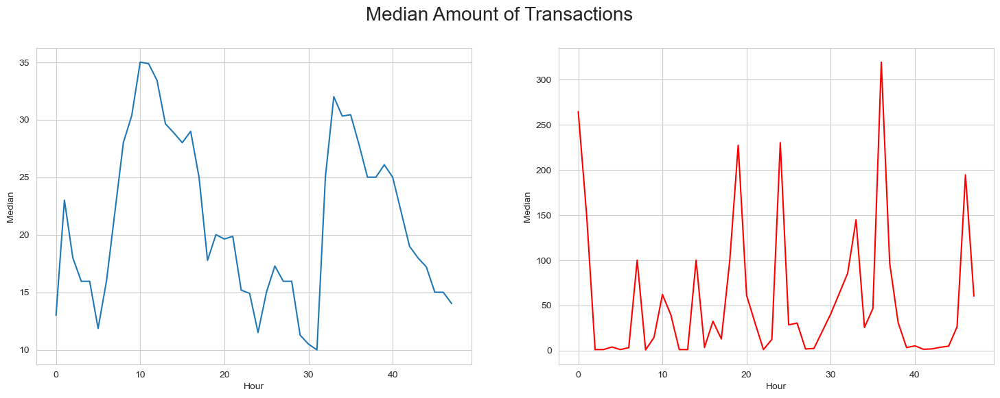

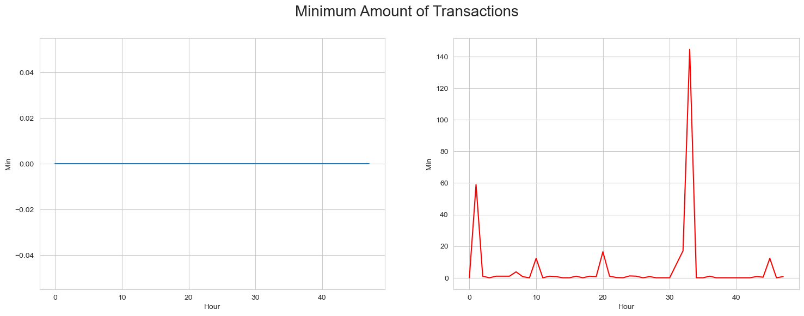

| Description | Class 0      | Class 1    |
| ----------- | -----------  |----------- |
| Count       | 284315.000000| 492.000000 |
| Mean        | 88.291022    | 122.211321 |
| Std         | 250.105092   | 256.683288 |
| Min         | 0.000000     | 0.000000   |
| 25%         | 5.650000     | 1.000000   |
| 50%         | 22.000000    | 9.250000   |
| 75%         | 77.050000    | 105.890000 |
| Max         | 25691.160000 | 2125.870000|

Valid transactions have a higher mean value, larger first quartile (Q1), smaller third and fourth quartiles (Q3 and Q4), and more significant outliers. On the other hand, fraudulent transactions have a smaller Q1 and mean value, larger Q4, and fewer significant outliers.

The graph below shows the amount of fraudulent transactions plotted against time, which is measured in seconds from the beginning of the 48-hour time period.

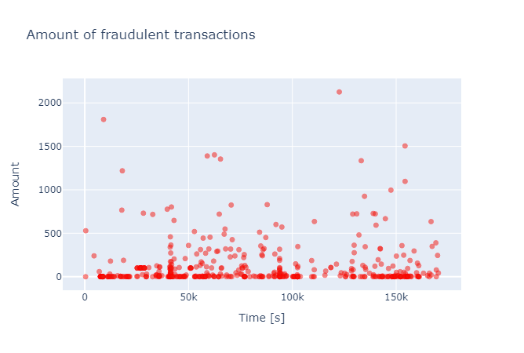

### Feature Correlation

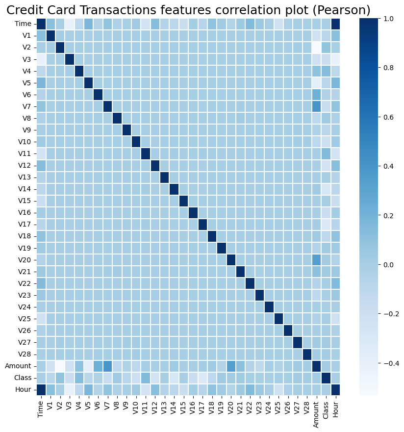

There is no significant correlation between the features `V1-V28`. However, some of these features exhibit a correlation with Time `(V3 has an inverse correlation)` and Amount `(V7 and V20 have a direct correlation, while V1 and V5 have an inverse correlation)`.

We will create a graph displaying the directly correlated and inversely correlated values on the same plot. We will begin with the directly correlated values, which are `{V20;Amount}` and `{V7;Amount}`.

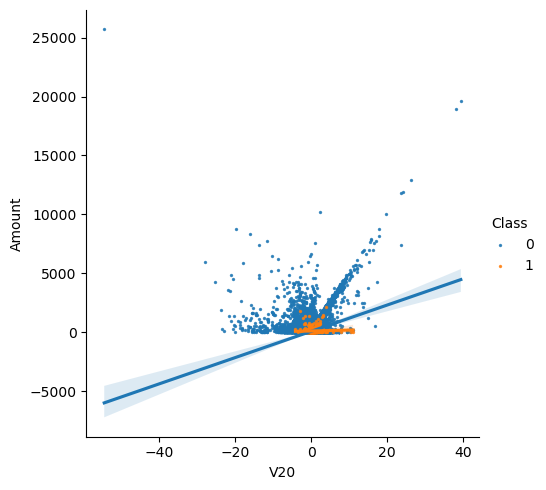

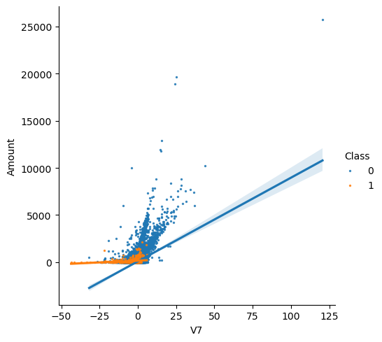

We can verify that the two sets of features are correlated by observing that the regression lines for Class = 0 have a positive slope, while the regression line for Class = 1 has a slightly smaller positive slope.

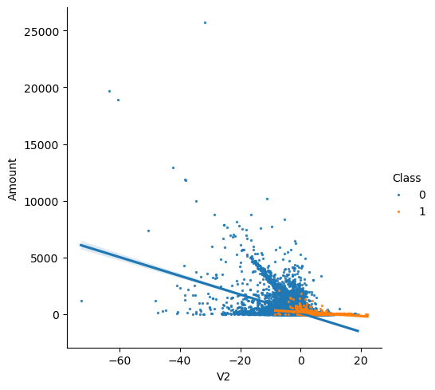

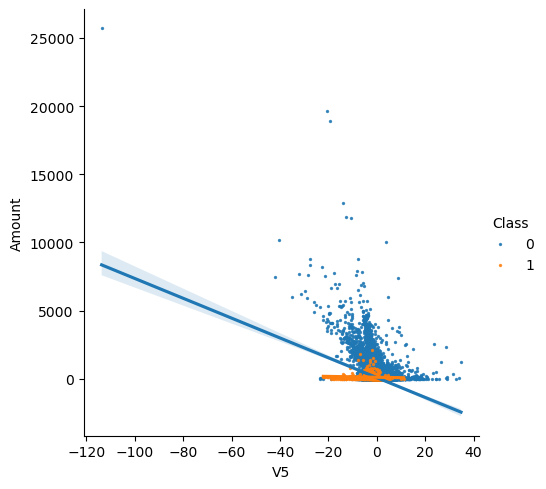

We can verify that the two sets of features are inversely correlated by observing that the regression lines for Class = 0 have a negative slope, while the regression lines for Class = 1 have a very small negative slope.

### Feature Density Plot

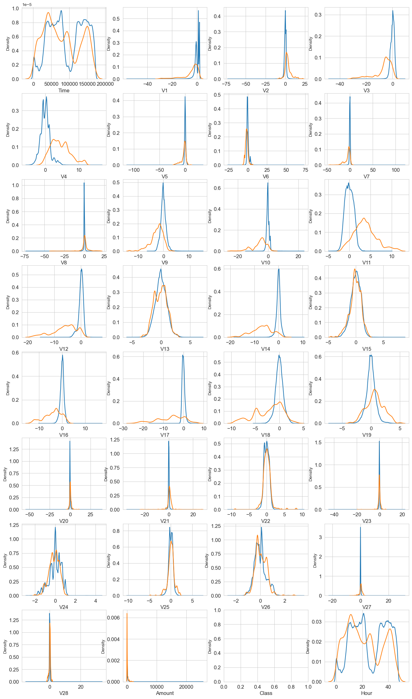

We can observe good selectivity for certain features in terms of their distribution for the two Class values. Specifically, V4 and V11 have clearly separated distributions for Class values 0 and 1, while V12, V14, and V18 are partially separated. `V1`, `V2`, `V3`, and `V10` have a distinct profile, while `V25`, `V26`, and `V28` have similar profiles for the two Class values.

Overall, apart from `Time` and `Amount`, most legitimate transactions (`Class = 0`) have a distribution that is concentrated around 0, occasionally with a prolonged tail at one end. In contrast, fraudulent transactions (`Class = 1`) have an asymmetric or skewed distribution.

## Predictive Models

### Random Forest Classifier
Our validation metric will be GINI, which is calculated using the formula GINI = 2 * (AUC) - 1, where AUC stands for the Area Under the Curve (ROC-AUC) of the Receiver Operating Characteristic. Number of estimators is set to 100 and number of parallel jobs is set to 4.

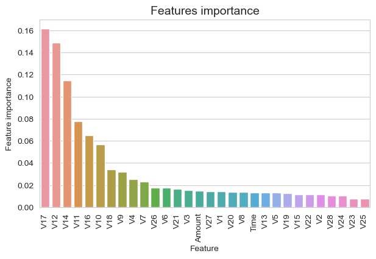

The most important features are `V17`, `V12`, `V14`, `V10`, `V11`, `V16`

It is important to note that when dealing with highly imbalanced data, confusion matrices may not be the most appropriate tool to use for representing results. Instead, we need to use metrics that take into account both the `selectivity` and `specificity` of the method being used, so as to minimize both `Type I` and `Type II errors` simultaneously.

For instance, the null `hypothesis (H0)` in this scenario would be that the transaction is not fraudulent, while the alternative `hypothesis (H1)` would be that the transaction is fraudulent. `A Type I error` would occur if the null hypothesis is rejected even though it is actually true, while a `Type II error` would occur if the null hypothesis is not rejected even though the alternative hypothesis is true.

In terms of the costs associated with these errors, a `Type I error` would result in the rejection of a legitimate transaction, while a `Type II error` would result in the acceptance of a fraudulent transaction.

### AdaBoost Classifier

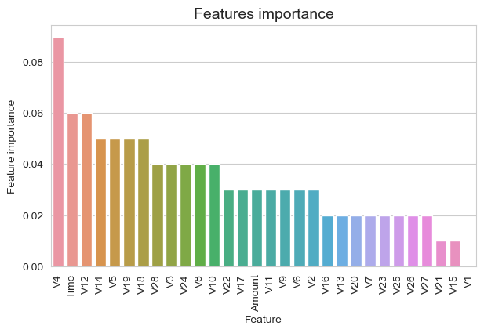

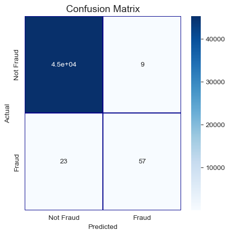

### CatBoost Classifier

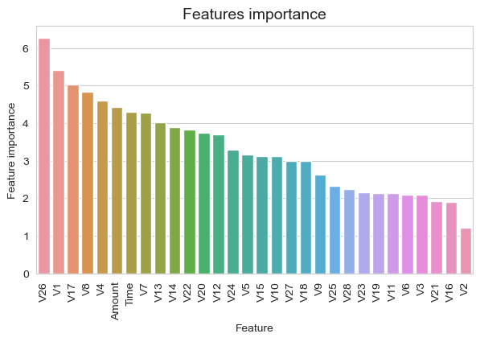

### XGBoost Classifier

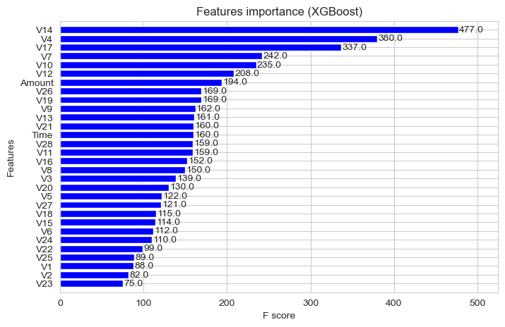

### LightGBM

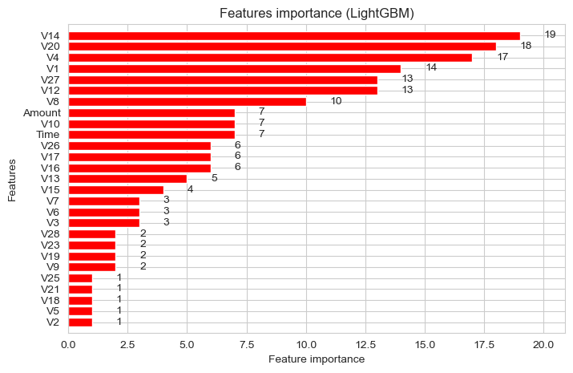

## Conclusion

| Model                   | ROC-AUC Score    |
| ----------------------  | -----------------|
| Random Forest Classifier| 0.85             |
| AdaBoost Classifier     | 0.83             |
| CatBoost Classifier     | 0.86             |
| XGBoost                 | 0.92             |
| LightGBM                | 0.95             |
| Cross-Validation        | 0.98             |

Initially, we conducted a thorough examination of the data, which involved assessing whether the data was unbalanced, analyzing the features, and understanding how they were related to each other. We then proceeded to build and evaluate two different predictive models using three subsets of data, namely the train set, validation set, and test set.

First, we employed a RandomForrestClassifier model and achieved an AUC score of `0.85` when predicting the target variable for the test set. We then implemented an AdaBoostClassifier model, which yielded a lower AUC score of `0.83` for predicting the test set target values. Subsequently, we utilized a CatBoostClassifier model, which resulted in an AUC score of `0.86` after training for `500` iterations.

Next, we experimented with an XGBoost model and employed the validation set for training model validation. We obtained a best validation score of `0.88` and used the model with the best training step to predict target values for the test data, resulting in an AUC score of `0.92`.

We also applied the data to a LightGBM model and evaluated its effectiveness in predicting the 'Class' value, which refers to detecting whether a transaction is fraudulent or not. We used both train-validation split and cross-validation methods to evaluate the model. Using the former approach, we obtained validation set AUC values of approximately `0.96`, while the AUC score for the test set was `0.947`. With cross-validation, we obtained an AUC score of `0.98` for predicting the test set values.

## References
[1] Credit Card Fraud Detection Database, Anonymized credit card transactions labeled as fraudulent or genuine, https://www.kaggle.com/mlg-ulb/creditcardfraud
[2] Principal Component Analysis, Wikipedia Page, https://en.wikipedia.org/wiki/Principal_component_analysis
[3] RandomForrestClassifier, http://scikit-learn.org/stable/modules/generated/sklearn.ensemble.RandomForestClassifier.html
[4] ROC-AUC characteristic, https://en.wikipedia.org/wiki/Receiver_operating_characteristic#Area_under_the_curve
[5] AdaBoostClassifier, http://scikit-learn.org/stable/modules/generated/sklearn.ensemble.AdaBoostClassifier.html
[6] CatBoostClassifier, https://tech.yandex.com/catboost/doc/dg/concepts/python-reference_catboostclassifier-docpage/
[7] XGBoost Python API Reference, http://xgboost.readthedocs.io/en/latest/python/python_api.html
[8] LightGBM Python implementation, https://github.com/Microsoft/LightGBM/tree/master/python-package
[9] LightGBM algorithm, https://www.microsoft.com/en-us/research/wp-content/uploads/2017/11/lightgbm.pdf
[10] Credit Card Fraud Dectection, https://www.kaggle.com/code/gpreda/credit-card-fraud-detection-predictive-models/notebook